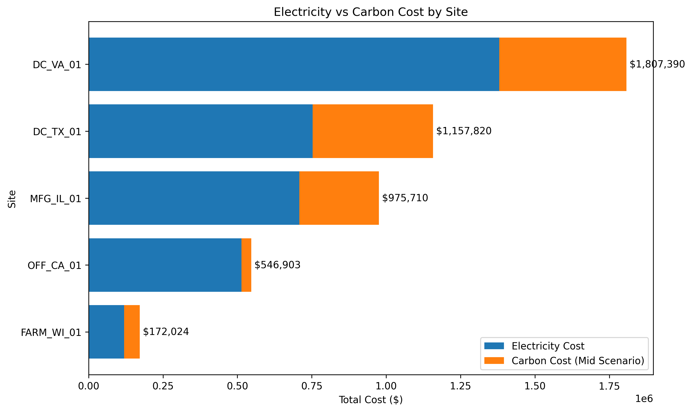

# ESG Cost Exposure Model: Electricity + Carbon Pricing

## Overview

This project models electricity cost exposure across a multi-site portfolio and evaluates how carbon pricing affects total operating costs.

It integrates:
- Electricity cost (baseline operational expense)
- Carbon pricing scenarios (transition risk)
- QA/QC-validated datasets

The objective is to translate energy and emissions data into financially material ESG risk insights.

---

## Key Findings

- Top cost exposure site  
  DC_VA_01 → ~$1.8M annual total cost  
  Driven by both high electricity demand and carbon cost contribution

- Transition risk concentration  
  Industrial and data center sites (VA, TX, IL) show significant cost increases under carbon pricing scenarios (>30%)

- Lower exposure sites  
  Smaller facilities (e.g., FARM_WI_01) remain primarily electricity-driven with limited carbon cost impact

---

## Analytical Insight

Electricity costs dominate baseline operations across all sites. However, carbon pricing materially alters cost structures for high-load, high-emission facilities.

This creates two distinct exposure profiles:
- Operational cost exposure → electricity-driven  
- Transition risk exposure → emissions and policy-driven  

This distinction supports:
- ESG reporting (Scope 2 and transition risk)
- Capital allocation and prioritization
- Decarbonization strategy development

---
## Visualization

### Portfolio Transition Cost Exposure

This visualization separates:
- Electricity cost (baseline)
- Carbon cost (policy-driven impact under mid scenario)

---

## Methodology

- Aggregated portfolio-level electricity costs from processed datasets  
- Applied carbon pricing to estimate transition-related cost exposure  
- Structured data with QA/QC checks to ensure consistency and completeness  
- Generated site-level comparisons to identify high-risk assets  

---

## QA/QC Checks

This project includes basic data quality controls to ensure reliability of financial outputs:

- Verified no missing values in key fields (electricity_cost, emissions)
- Checked for duplicate site entries
- Ensured all cost values are positive and within expected ranges
- Validated aggregation consistency (site-level → portfolio totals)

These checks reduce the risk of misleading cost estimates and support defensible ESG reporting.

---

## Data Sources

- Portfolio electricity cost dataset (processed)
- State-level electricity price data (QA/QC validated)
- Carbon pricing scenario (mid-case assumption)

---

## Project Structure

us-energy-carbon-fpa-qaqc-model/

├── data_processed/  
│   ├── portfolio_electricity_costs.csv  
│   ├── electricity_prices_qc.csv  
│   └── state_electricity_prices_qc.csv  

├── src/  
│   ├── main.py  
│   └── plot_cost_breakdown.py  

├── outputs/  
│   └── portfolio_transition_cost_exposure.png  

├── requirements.txt  
└── README.md  

---
## How to Run

Navigate to project:

cd "C:\Users\hveis\OneDrive - UWSP\ESG\QA-QC\US\us-energy-carbon-fpa-qaqc-model"

Run the script:

.\.venv\Scripts\python.exe src\plot_cost_breakdown.py

---

## Tools & Methods

- Python (pandas, matplotlib)
- QA/QC validation checks
- Scenario-based cost modeling
- Portfolio-level aggregation

---

## Why This Matters

Most ESG work stops at emissions reporting.

This project connects:
energy use → emissions → carbon pricing → financial impact

It shows how sustainability data translates into:
- cost exposure
- transition risk
- operational decision-making

---

## Next Steps

- Add carbon cost share (%) by site to identify policy-sensitive assets  
- Integrate eGRID emission factors for Scope 2 accuracy  
- Expand scenarios (low, mid, high carbon pricing)  
- Build an interactive dashboard (Power BI or Streamlit)

---

## Author

Hadi Veisi  
Sustainability and ESG Analytics  
Energy, Climate Policy, and Data Systems
